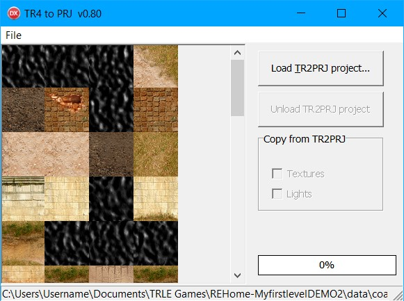

# TR42PRJ
A program for the Tomb Raider Level Editor (TRLE) community.

Converts a Tomb Raider 4 .TR4 file to a TRLE project .prj file

aktrekker's TR2PRJ program doesn't get the geometry correct especially for some split sectors.
This is an attempt to do a better job.

Advantages over TR2PRJ:
- More accurate geometry maybe
- TGA file alpha channel handled correctly
- Open Source

Disadvantages:
- Only for TR4 files
- No objects extracted
- No lights extracted
- No texturing info extracted (how aktrekker do this?)
- No triggers extracted

This is a Delphi 10.3.3 project.

Delphi 10 Community Edition is currently available for free.
https://www.embarcadero.com/products/delphi/starter

The Vampyre Imaging Library is required for .TGA support.
Download and change the Search Path in the Project Options setting to location of Imaging Library.
This project assumes Imaging folder is in project directory.
Use the version from the Mercurial repository since the latest release version does not compile with Delphi XE7.
http://sourceforge.net/p/imaginglib/code/ci/default/tree/

# Usage:
Open .TR4 file. The room textures will be displayed.

Click Save As to save the .prj file and .tga file.

Only geometry and doors will be extracted to the .prj.

If you load a TR2PRJ project created from the same .TR4 then you have the option
to import the textures and/or light info from that project.

To save the .tga file only, right click on the image and select Save TGA.

# Notes:
The geometry will not be perfect. Tall split sectors cannot be decompiled exactly
for instance.

The .prj file will generate some error messages when loaded in the level editor.

  A "Broken map at room 0" error will always appear. This will be auto repaired.

  The cause of this error is known. It is required so the editor links all the rooms
  for moving in the 2D map display.

  Texture importing will generate additional errors that will also be reported as fixed.
  The cause of these errors is not known yet.

If aktrekker reading this, please consider releasing TR2PRJ source code.

